# STM32 视觉跟随小车 (Visual Following Robot)

> **项目状态**: [开发中]
> **核心平台**: STM32F407ZGT6 | OpenMV | U8g2
> **功能目标**: 实现基于颜色/物体识别的自动跟随功能，具备双环 PID 控制与多重安全保护。

---

## 1. 系统概述 (System Overview)

本项目旨在构建一个高性能、模块化的视觉跟随机器人平台。系统以 **STM32F407** 为控制核心，通过 **OpenMV** 机器视觉模块实时捕获目标位置，利用双环串级 PID 算法实现对目标的平滑跟随。软件架构采用 **自定义协同式任务调度器** 与 **硬件定时器中断** 相结合的方式，既保证了人机交互和通信的灵活性，又确保了底层运动控制的硬实时性。

### 1.1 软件分层架构 (Software Architecture)

---

## 2. 简介 (Introduction)

视觉跟随小车是移动机器人领域的典型应用，涵盖了嵌入式系统设计、机器视觉、自动控制原理等多个技术领域。本项目的核心特点包括：
*   **硬件解耦**: 驱动层 (BSP) 与应用层 (App) 分离，便于移植。
*   **硬实时控制**: 100Hz 的控制回路独立于主循环任务，由硬件定时器触发，确保控制周期抖动极小。
*   **安全可靠**: 内置视觉丢包检测、数据异常过滤和急停保护机制。
*   **交互友好**: 配备 OLED 显示屏和按键，支持脱机参数调整 (PID 参数) 和状态监控。

---

## 3. 硬件接口定义 (Hardware Pinout)

本项目基于 **STM32F407ZGT6** 开发板，关键外设连接如下：

### 3.1 系统架构框图 (System Architecture)

### 3.2 电机与编码器 (Motor & Encoder)
| 模块 | 信号 | 引脚 | 定时器 | 说明 |
| :--- | :--- | :--- | :--- | :--- |
| **左电机** | PWM | PD13 | TIM4_CH2 | 10kHz PWM |
| | IN1/IN2 | PB12 / PB13 | N/A | 方向控制 |
| | 编码器 A/B | PA6 / PA7 | **TIM3** | 4倍频计数 |
| **右电机** | PWM | PD12 | TIM4_CH1 | 10kHz PWM |
| | IN1/IN2 | PB14 / PB15 | N/A | 方向控制 |
| | 编码器 A/B | PA0 / PA1 | **TIM5** | 4倍频计数 |
| **驱动** | STBY | PG8 | N/A | 驱动使能 (High Enable) |

### 3.3 传感器与交互 (Sensors & UI)
| 模块 | 信号 | 引脚 | 通信协议 | 说明 |
| :--- | :--- | :--- | :--- | :--- |
| **OpenMV** | TX / RX | PC6 / PC7 | **USART6** | 115200bps, 8N1 |
| **WiFi (ESP8266)** | TX / RX | PA2 / PA3 | **USART2** | 115200bps, 8N1 |
| **GPS** | TX / RX | PB10 / PB11 | **USART3** | DMA+IDLE 接收 |
| **LED** | LED1-4 | PD14, PD15, PC9, PC8 | GPIO | 低电平点亮 (共阳) |
| **按键** | KEY1-4 | PE4, PE5, PE7, PE8 | GPIO | 低电平有效 (消抖) |
| **OLED** | SCL/SDA | PB8 / PB9 | I2C1 | U8g2 图形库驱动 |

---

## 4. 通信协议 (Communication Protocol)

STM32 与 OpenMV 之间通过串口 (USART6) 通信，波特率 **115200**。
数据包格式为固定 **4 字节**：

| 字节索引 | 定义 | 值/范围 | 说明 |
| :---: | :--- | :--- | :--- |
| 0 | **帧头 (Header)** | `0xAA` | 固定帧头 |
| 1 | **X 坐标 (Data X)** | `0 - 160` | 目标在图像中的 X 轴坐标 |
| 2 | **距离 (Data Dist)** | `0 - 255` | 目标距离 (单位: cm) |
| 3 | **帧尾 (Tail)** | `0x55` | 固定帧尾 |

*注意：若未检测到目标，OpenMV 应发送 `x=0, dist=0`，此时小车会自动停止。*

---

## 5. 任务调度 (Task Scheduling) - 非抢占式核心控制

虽然系统运行了**自定义协同式任务调度器**，但**核心运动控制并不依赖任务调度**，而是采用更确定的**硬件定时器中断**机制。这种设计被称为“前后台系统”架构：

*   **前台 (Foreground - Interrupts)**: 处理对时间极其敏感的逻辑（电机控制、编码器采样）。
*   **后台 (Background - Cooperative Tasks)**: 处理耗时、低实时性要求的逻辑（OLED 刷新、按键扫描、日志打印）。

### 5.1 核心控制回路 (100Hz)
由 **TIM14** 定时器每 **10ms** 触发一次中断，优先级设置为最高。

**执行时序**:
1.  **数据解析**: 检查 OpenMV 数据缓冲区，解析最新一帧目标信息 (`x`, `dist`)。
2.  **速度测量**: 读取 TIM3/TIM5 寄存器，计算左右轮实时转速 (RPM)。
    *   公式: $RPM = \frac{Count \times 60}{PPR \times 4 \times Ratio \times \Delta t}$
3.  **安全检查**: 检查 `loss_counter`，若连续丢失目标则触发减速或急停。
4.  **PID 运算**: 依次执行位置环 (PD) 和速度环 (PI) 计算。
5.  **执行输出**: 将计算得到的 PWM 值写入 TIM4 比较寄存器。

---

## 6. 核心算法 (Core Algorithm)

### 6.1 运动学解算 (Kinematics)
本项目采用典型的两轮差速驱动模型 (Differential Drive)。

**符号定义**:
*   $v_{linear}$: 机器人整体期望线速度
*   $v_{angular}$: 机器人整体期望角速度 (正为右转，负为左转)
*   $v_L, v_R$: 左、右轮期望线速度
*   $L$: 轮间距 (Track Width)

**解算公式**:
$$
\begin{cases}
v_L = v_{linear} - v_{angular} \\
v_R = v_{linear} + v_{angular}
\end{cases}
$$
*(注：代码中简化了模型，直接将 PID 输出的角速度分量叠加到左右轮，未乘轮间距系数，通过 PID 参数 $K_p$ 隐式包含)*

### 6.2 总控制公式 (General Control Formula)

系统的核心控制逻辑可以总结为以下级联控制公式：

$$
\begin{cases}
e_{dist} = dist_{measured} - dist_{target} \\
e_{angle} = x_{center} - x_{measured} \\
\\
v_{linear} = PID_{dist}(e_{dist}) \\
v_{angular} = PID_{angle}(e_{angle}) \\
\\
v_{L\_target} = v_{linear} - v_{angular} \\
v_{R\_target} = v_{linear} + v_{angular} \\
\\
PWM_L = PID_{speed}(v_{L\_target}, v_{L\_actual}) \\
PWM_R = PID_{speed}(v_{R\_target}, v_{R\_actual})
\end{cases}
$$

其中：
*   $dist_{target} = 20 \text{cm}$ (设定跟随距离)
*   $x_{center} = 80$ (图像中心 X 坐标)
*   $PID_{speed}$ 为内环速度 PID，确保电机转速精确跟随目标值。

### 6.3 双环串级 PID 控制 (Dual-Loop Cascaded PID)

控制系统分为外环（位置/角度）和内环（速度）。

#### A. 外环：视觉位置环 (Position Loop)
目标是使机器人与目标保持固定距离，并始终正对目标。

*   **距离控制器 (Distance Controller)**:
    *   输入: $Error_{dist} = Actual_{dist} - Target_{dist}$ (20cm)
    *   输出: $v_{linear}$
    *   算法: **PD 控制** (比例+微分)
    $$ v_{linear} = K_{p\_dist} \cdot E_{dist} + K_{d\_dist} \cdot \frac{dE_{dist}}{dt} $$

*   **角度控制器 (Angle Controller)**:
    *   输入: $Error_{angle} = Target_{center} (80) - Actual_{x}$
    *   输出: $v_{angular}$
    *   算法: **PD 控制**
    $$ v_{angular} = K_{p\_angle} \cdot E_{angle} + K_{d\_angle} \cdot \frac{dE_{angle}}{dt} $$

#### B. 内环：电机速度环 (Speed Loop)
目标是使电机实际转速快速跟随外环输出的期望转速。

*   **速度控制器**:
    *   输入: $Error_{rpm} = Target_{rpm} - Actual_{rpm}$
    *   输出: $PWM$ (0-4200)
    *   算法: **PI 控制** (比例+积分)
    $$ PWM = K_{p\_speed} \cdot E_{rpm} + K_{i\_speed} \cdot \int E_{rpm} dt $$
    *   **抗饱和**: 当 PWM 达到最大值时，停止积分累加。

### 6.4 安全保护机制
*   **视觉丢包保护**: 
    *   连续 **10帧** (100ms) 未收到数据 -> 保持上一帧速度 (惯性滑行)。
    *   连续 **20帧** (200ms) 未收到数据 -> **强制急停** (PWM=0)。
*   **数据零值保护**: 当收到 `x=0, dist=0` 时，清除 PID 历史误差并立即停车，防止误动作。

---

## 7. 参数存储 (Flash Storage)

系统利用 STM32F407 内部 Flash (Sector 11) 模拟 EEPROM，用于掉电保存关键参数：

*   **存储地址**: `0x080E0000`
*   **保存内容**:
    *   距离环 PID参数 (`Kp, Ki, Kd`)
    *   角度环 PID参数 (`Kp, Ki, Kd`)
    *   左/右电机速度环 PID参数
*   **操作方式**: 可通过 OLED 菜单在线调整参数，并长按按键保存。

---

## 8. 快速开始 (Quick Start)

1.  **硬件连接**: 按照第 3 节连接电机、电池、OpenMV 和 OLED。
2.  **OpenMV 烧录**: 将配套的 Python 脚本 (`main.py`) 存入 OpenMV，确保其输出符合第 4 节协议。
3.  **上电启动**: 
    *   默认进入 **MANUAL (手动)** 模式。
    *   通过按键切换至 **AUTO (自动)** 模式。
4.  **调试**:
    *   观察 OLED 屏幕上的 `Mode` 状态和 `V/W` (线速度/角速度) 数值。
    *   若小车原地打转，请检查电机线序或 PID 参数符号。

---
*Document updated on 2026-02-22*
